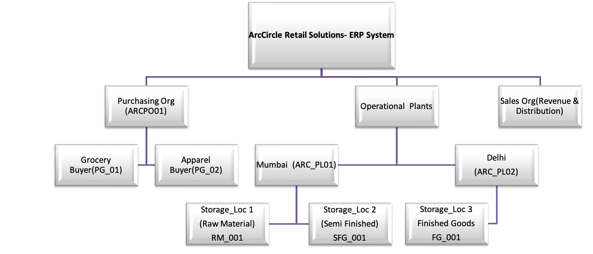

### Phase 1: SAP MM Business Blueprint (ArcCircle)

### Project Concept
This phase documents the Architectural Planning for the ArcCircle enterprise. Over the first week of my SQL journey, I used SAP S/4HANA (MM) as a conceptual framework to design a logical business hierarchy.

Rather than jumping straight into code, I "blueprinted" the enterprise in Excel to ensure the database would handle complex business relationships—such as multiple plants under one company code and the link between purchasing and sales.

---

### Enterprise Organizational Hierarchy
The diagram below represents the three-pillar strategy (Purchasing, Operations, and Sales) under the legal entity **ARC1**.

#### *** Level 1: Company Code — ARC1 (ArcCircle Retail India Pvt Ltd)**
The highest legal entity for financial consolidation and statutory reporting. In this technical implementation, all inventory valuation from the Mumbai (ARC_PL01) and Delhi (ARC_PL02) plants rolls up to this entity to ensure accurate financial tracking and tax compliance.

#### **Level 2: Parallel Mapping (The Three Pillars)**
1. **Purchasing Org (ARC_PO01):** Strategic procurement unit handling all India operations and responsible for negotiating with **Vendors V_001 to V_005**.
2. **Operational Plants (ARC_PL01 & ARC_PL02):** Physical hubs where materials are received, stored, and valuated. **Mumbai** serves as the Assembly hub, while **Delhi** acts as the Regional Distribution Center.
3. **Sales & Distribution (SD):** The "Outbound" pillar that triggers the reduction of inventory via Sales Orders, closing the loop on the Material Master lifecycle.

---

### Phase 1 Artifacts
* [**Enterprise_Data_Master.xlsx**](./Enterprise_Data_Master.xlsx)
  *Contains the 13 Master Data sheets: Company Code, Plant, Material Master, Vendor Master, etc.*
* [**Org_Structure_Diag.png**](./Org_Structure_Diag.png)
  *The visual Business Blueprint of the enterprise.*

---

### Professional Statement
> "In this phase, I translated SAP's enterprise ideology into a custom business architecture. By planning the hierarchy in Excel first, I ensured that the resulting SQL database wasn't just a collection of tables, but a functional engine capable of safeguarding the 'Procure-to-Cash' lifecycle. This demonstrates my ability to lead with business logic before executing with technical code." 
